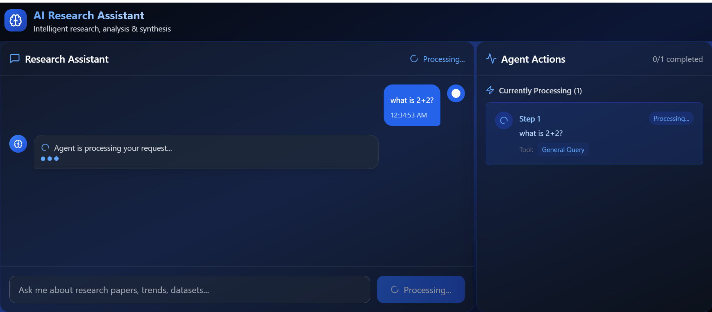
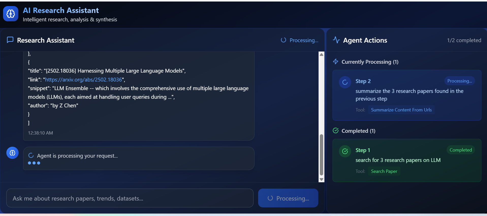

# Project Setup Guide

## Requirements

- Node.js v22+
- Python 3.11+

## Installation

### 1. Clone the repository
```bash
git clone https://github.com/tapan0p/research-agent.git
cd research-agent
```

### 2. Backend Setup
```bash
cd backend
python -m venv venv
source venv/bin/activate  # On Windows: venv\Scripts\activate
pip install -r requirements.txt
```

#### Environment Configuration
Create a `.env` file in the `backend` directory with the following variables:
```bash
GOOGLE_API_KEY=your-google-api-key
serpapi_api_key=your-serpapi-api-key
```

### 3. Frontend Setup
```bash
cd frontend
npm i
```

## Running the Application

### Start the Backend
```bash
cd backend
source venv/bin/activate  # On Windows: venv\Scripts\activate
uvicorn main:app --reload
```

### Start the Frontend
```bash
cd frontend
npm run dev
```

After completing the setup steps above, your application should be running with:
- Frontend: Usually available at `http://localhost:3000`
- Backend: Usually available at `http://localhost:8000`

Check your terminal output for the exact URLs.





